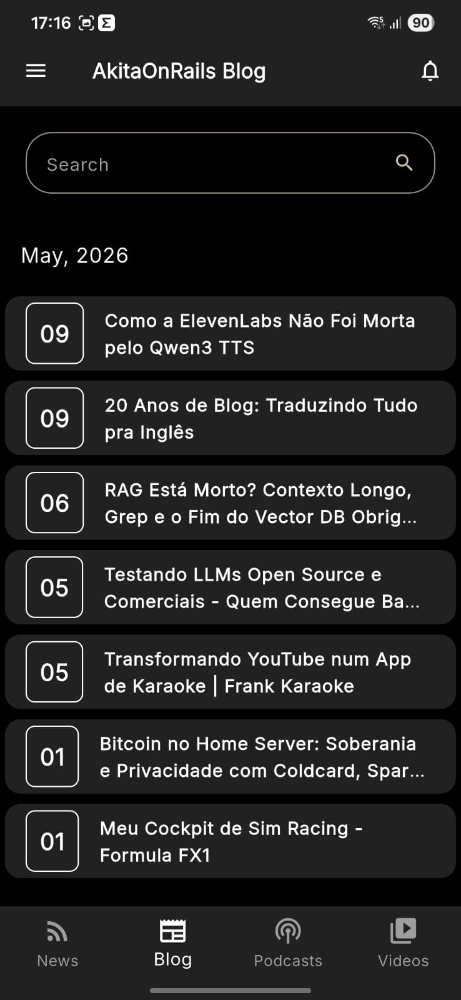

<div align="center">
  <h1>The Makita Verse</h1>

  <p align="center">
    <a href="https://www.python.org/"></a>
    <a href="https://flutter.dev/"></a>
    <a href="https://dart.dev/"></a>
    <a href="https://github.com/features/actions"></a>
    
  </p>
  <p align="center">Centralizing and mapping the content universe of Fabio Akita.</p>
</div>

---

## 🎯 Objective

The main objective of this project is to perform a **DUMP** of various sources of information regarding Fabio Akita. The content collection (blog articles, podcasts, and videos) is carried out using a crawler built in **Python**, which runs continuously via a **Github Actions** schedule (cron).

The updated data is available and saved as JSON files inside the static directory `/data`, which in turn is consumed asynchronously by our **mobile and web application developed with Flutter**.

---

## 🏗️ Project Structure

The architecture is organized into isolated ecosystems acting together:

- `apps/`: Dart/Flutter workspace encompassing the main application.
- `data/`: Central storage directory (source of truth) where the structured data from the crawler resides in JSON format (e.g., `articles/`, `podcasts/`, `channel/`).
- `scripts/`: The heart of the extraction, housing all the Crawler source code.
- `.github/workflows/`: Repository meant to save job routines and CI/CD pipelines.

---

## ⚙️ How It Works

The repository automates the extraction and compilation via **two essential workflows**:

1. **Dump Newsletter (`dump_newsletter.yml`)**  
   Runs a daily _cronjob_ (`0 0 * * *`) that triggers scraping data for new content. If there's new content, the script finishes by autonomously committing the updates into the `/data` base. Instead of applications directly requesting from the sources (causing slowness and rate-limits), they act by simply reading these previously extracted static files.
2. **Build and Deploy Mobile (`build_mobile_release.yml`)**  
   Whenever robust modifications reach the `release` branch, the integration triggers the build for the Android environment. After completion, it automatically links the signed `APK` of the application to a new Release here on Github itself.

---

## 🛠️ Technologies

The tool stack was chosen to act directly on the demands of intensive extraction and cross-platform flexibility in the final project. Their responsibilities are separated below:

### 🐍 Scripts (Crawler and Extraction)

- **[](https://www.python.org/)**: Motor behind all the scraping.
- **`requests` & `beautifulsoup4`**: Network requests and semantic extraction to fetch posts and metadata on the blog or in podcast catalogs.
- **`yt-dlp`**: Deep integration to scrape raw information from YouTube playlists and associated channels without needing authentication on the limiting official Data API.

### 📱 Frontend (Mobile and Web App)

- **[](https://dart.dev/)[](https://flutter.dev/)**: Modern UI construction that runs smoothly on target devices.
- **Workspaces Architecture**: To handle the project scale, the Dart project acts in Mono-Repo molds.
  - `apps/mobile`: Compilation directed to applications installed on Android/iOS.

---

## 🧪 How to Test

To check the services locally in your scope, run the instructions below.

### Test Data Extraction (Python Scripts)

It is preferable to isolate the engine using a virtual environment (venv) to avoid dependency conflicts.

```bash
cd scripts
python3 -m venv venv
source venv/bin/activate  # Windows environment: venv\Scripts\activate
pip install -r requirements.txt
```

Once the installation is complete, invoke `main.py` directly passing the scope you want to re-extract and test:

```bash
# To collect main blog Articles
python main.py --target articles

# To collect Podcast information
python main.py --target podcasts

# To collect Video Channel metadata (Youtube)
python main.py --target videos
```

### Test the Application (Flutter Frontend)

Ensure you have the [Flutter SDK configured in your Path](https://docs.flutter.dev/get-started/install) and the emulator running.

```bash
cd apps/mobile
flutter pub get
flutter run
```

---

## 📱 Application Screens

<table align="center">
  <tr>
    <td align="center"></td>
    <td align="center"></td>
    <td align="center"></td>
    <td align="center"></td>
    <td align="center"></td>
  </tr>
</table>

---

## 🤝 How to Contribute

Any feedback or PRs to add to the crawlers or app animations are highly welcome!

1. **Fork** the scope to your original github;
2. Create your isolated **Branch** (`git checkout -b feature/your_wonderful_contribution`);
3. Make relevant **Commits**, aiming for a clear message (`git commit -m 'feat: changed main logic of yt-dlp'`);
4. Push the change with a **Push** to the rebased branch (`git push origin feature/your_wonderful_contribution`);
5. Submit a **Pull Request** in our tab.
